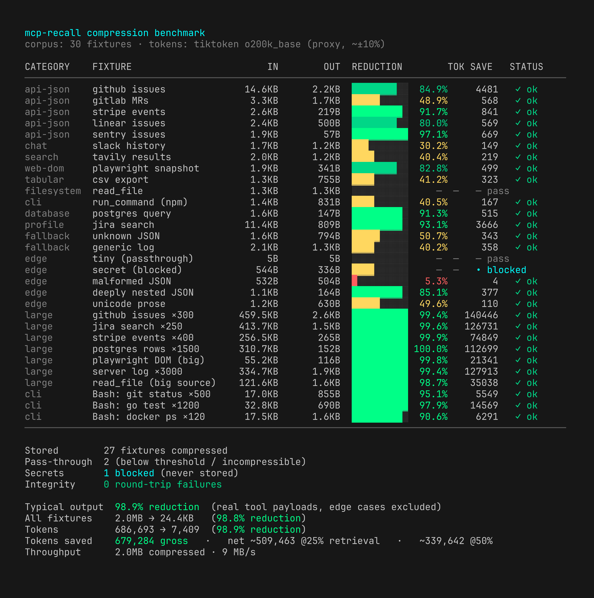

# mcprecall

Context compression for Claude Code. `mcprecall` intercepts large MCP and Bash
tool outputs, compresses them to a short summary, and stores the full content in
a local SQLite database. Claude sees the summary plus a recall ID and pulls the
full text back only when it actually needs it — keeping the context window small
without losing information.

It ships as a single static binary (pure-Go SQLite, no CGO, no external
runtime).

> A Go rewrite of [**@sakebomb**](https://github.com/sakebomb)'s excellent
> [mcp-recall](https://github.com/sakebomb/mcp-recall) — same idea, ported to a
> dependency-free Go binary with a full benchmarking suite and some personal
> tuning. See [Credits](#credits).

## How it works

1. **PostToolUse hook** — after a tool runs, `mcprecall` compresses its output.
   A matching profile (or the built-in structure-aware fallback) produces a
   summary; the full output is stored with an FTS5 index and returned to Claude
   as a summary + `recall_<id>` reference, along with suggested search terms.
2. **SessionStart hook** — at the start of a session, a compact snapshot of
   prior context (pinned items, notes, recent and frequently-accessed outputs)
   is injected so Claude resumes with orientation.
3. **MCP server** — exposes `recall__*` tools so Claude can retrieve, search,
   pin, annotate, and manage stored content on demand.

Storage is scoped per project (by git root or working directory), so outputs
from one repository never leak into another.

## Install

```sh
go build -o mcprecall ./cmd/mcprecall
./mcprecall install
```

`install` registers the MCP server in `~/.claude.json`, adds the
SessionStart/PostToolUse hooks in `~/.claude/settings.json`, and injects usage
notes into `~/.claude/CLAUDE.md`. It is idempotent and non-destructive —
existing servers, hooks, and notes are preserved. Restart Claude Code to
activate.

Check state at any time:

```sh
./mcprecall status
./mcprecall uninstall   # removes only mcprecall's own entries
```

## Commands

```
mcprecall <command> [options]

  install              Register hooks + MCP server in Claude Code
  uninstall            Remove hooks + MCP server
  status               Show current configuration and health
  server               Run the recall MCP server (stdio)
  profiles <cmd>       Manage compression profiles
  learn                Generate profile suggestions from your installed MCPs
  import <file>        Restore items from a recall__export JSON dump
  completions <shell>  Print a shell completion script (bash, zsh, fish)
  --help, -h           Show help
  --version, -v        Show version
```

Shell completions:

```sh
./mcprecall completions zsh  >  ~/.zfunc/_mcprecall
./mcprecall completions bash >  /etc/bash_completion.d/mcprecall
./mcprecall completions fish >  ~/.config/fish/completions/mcprecall.fish
```

## MCP tools

Available to Claude through the MCP server:

| Tool | Purpose |
| --- | --- |
| `recall__retrieve` | Fetch stored content by ID. Modes: `summary`, `peek` (bounded multi-chunk window), `full` |
| `recall__search` | Full-text search across stored outputs |
| `recall__context` | Session-orientation snapshot (pinned, notes, recent, hot) |
| `recall__list_stored` | List stored outputs, filterable and paginated |
| `recall__note` | Save a durable note across sessions |
| `recall__pin` | Protect an item from expiry and eviction |
| `recall__forget` | Delete stored outputs |
| `recall__stats` | Storage and compression statistics |
| `recall__session_summary` | Digest of a session's activity |
| `recall__suggest` | Pin/cleanup recommendations |
| `recall__export` | Export stored items as a JSON dump (restore with `import`) |

## Compression profiles

Profiles are declarative TOML files that describe how to summarize a specific
MCP tool's output. Three strategies are supported:

- `json_extract` — pull named fields from a list of items into a compact digest
- `json_truncate` — cap nesting depth and array length of a JSON payload
- `text_truncate` — trim plain text to a character budget

Profiles resolve across three tiers, most specific wins: **user** →
**community** → **bundled**. When no profile matches, a structure-aware
deterministic fallback compresses the output (head/tail with error/warning lines
surfaced from the middle).

Generate a starting profile for an installed MCP server:

```sh
./mcprecall learn
```

Manage profiles with `mcprecall profiles <list|available|info|install|update|remove|seed|feed|check|retrain|test>`.

## Configuration

Config lives at `~/.config/mcp-recall/config.toml`. A missing file uses
defaults; an invalid file falls back to defaults. All keys are optional and
override field-by-field.

```toml
[store]
expire_after_session_days    = 30        # prune items older than N session-days
key                          = "git_root" # project scope: "git_root" | "cwd"
max_size_mb                  = 500        # per-project store cap (accepts fractional MB)
max_pinned_mb                = 250        # cap on pinned data (defaults to half of max_size_mb)
pin_recommendation_threshold = 5          # access count before suggesting a pin
stale_item_days              = 3          # age before flagging cleanup candidates
eviction_half_life_days      = 7          # decay half-life for recency-weighted eviction
gc_reminder_mb               = 2048       # nudge to run `gc` past this store size (0 disables)
retention                    = "balanced" # which bodies stay retrievable: "full" | "balanced" | "minimal"
                                          # balanced keeps MCP/web/API results and network Bash
                                          # (curl/wget/gh api) and stores reproducible Bash
                                          # (git/tests/ls/grep) summary-only; notes always keep theirs

[retrieve]
default_max_bytes = 8192                  # default retrieve size cap

[denylist]
additional        = []                    # extra tool-name patterns to never store
override_defaults = []                    # replace the built-in denylist entirely
allowlist         = []                    # un-block specific tools from the denylist

[profiles]
verify_signature = "warn"                 # community profile signature policy: "warn" | "error" | "skip"
                                          # "error" requires verification to *succeed* — a missing or
                                          # too-old gh CLI is fatal; use --skip-verify to bypass

[debug]
enabled = false
```

### Storage size

The store enforces the `max_size_mb` cap with **recency-weighted eviction**:
each item's value is `(access_count + 1)` decayed by an exponential half-life on
the time since last use, so a stale but once-popular item is shed before a fresh
one. Pinned items are never evicted.

Because pinned items are eviction-exempt, an unbounded number of pins would
silently void `max_size_mb`. They are therefore bounded separately by
`max_pinned_mb`, enforced at pin time: a pin that would exceed the cap is
refused and the item is left unpinned. Unpinning always succeeds. When
`max_pinned_mb` is not set explicitly it derives as half of `max_size_mb`, so
lowering the total cap alone can never produce a `max_pinned_mb > max_size_mb`
contradiction; setting both in contradiction rejects the config to defaults.
`recall__stats` reports pinned usage against the cap and warns past 80%.

### Reclaiming disk — `mcprecall gc`

Per-project databases outlive their projects: once a project directory is
deleted its database is never reopened, so the session-start prune never runs
against it and it lingers forever. `gc` classifies every `*.db` in the store and
reports what can be reclaimed.

```
mcprecall gc                      # dry run — report only, nothing deleted
mcprecall gc --force              # delete the marked databases
mcprecall gc --stale-days 30      # widen/narrow the legacy window (default 90)
mcprecall gc --vacuum             # full-VACUUM the databases being kept
```

Classification drives a single deletion policy:

| Status | Meaning | Deleted by `--force` |
|---|---|---|
| `current` | the live project's database | never |
| `active` | recorded path still exists | never |
| `ORPHANED` | recorded path gone, **parent still exists** — project really deleted | yes |
| `unverifiable` | path *and* parent gone (likely an unmounted volume), or a relative path with no knowable root | never |
| `legacy` | no recorded path, recently modified | never |
| `LEGACY-STALE` | no recorded path, untouched past `--stale-days` | yes |
| `unreadable` | not an mcp-recall database, or corrupt | never |

Orphan detection needs a recorded `project_path`, which session-start writes on
each run — and only when it resolves to a real directory, so a bad guess can
never mark a live project as deleted. Databases predating this stay pathless and
are reclaimed solely on the untouched-for-N-days rule, never on a
deleted-project inference.

`--vacuum` is orthogonal to `--force`: it rewrites the databases being *kept*,
which reclaims free pages and upgrades legacy `auto_vacuum=NONE` stores to
incremental. It never touches deletion candidates, the live database, or
anything unverifiable.

## Security

`mcprecall` never persists credentials. Before storing, output is scanned for
secrets (PEM keys, cloud and API tokens, provider keys, connection strings) and
storage is skipped if any are found. Tool names associated with password
managers and secret stores, and tools whose names imply credential access, are
denied by default — configurable via the `[denylist]` section.

## Environment variables

| Variable | Effect |
| --- | --- |
| `RECALL_DB_PATH` | Override the SQLite database path (default `~/.local/share/mcp-recall/<project>.db`) |
| `RECALL_CONFIG_PATH` | Override the config file path |
| `RECALL_DEBUG` | `1` enables debug logging to stderr |
| `RECALL_USER_PROFILES_PATH` | Override the user profiles directory |
| `RECALL_COMMUNITY_PROFILES_PATH` | Override the community profiles directory |
| `RECALL_BUNDLED_PROFILES_PATH` | Override the bundled profiles source |
| `RECALL_MANIFEST_URL` | Override the community profile manifest URL |
| `RECALL_PROFILE_BASE_URL` | Override the community profile download base URL |

## Benchmark

A benchmark tool measures exactly how much compression buys you. It runs a
corpus of representative tool outputs through the real compression pipeline,
reports exact byte savings and estimated token savings, and **verifies every
stored item round-trips losslessly** — a fixture that can't be recovered
byte-for-byte fails the run.

```sh
go run ./cmd/bench            # live TUI
go run ./cmd/bench --report   # static, screenshot/CI-friendly report
```



Results on the bundled 30-fixture corpus — 2.0 MB of realistic tool output
spanning every handler, the native `Bash` path, content fallbacks, and edge
cases. Byte figures are exact; tokens are estimated with tiktoken `o200k_base`
as an offline proxy for Claude's tokenizer (~±10%):

| Fixture (realistic size) | In | Out | Reduction |
| --- | --- | --- | --- |
| postgres rows ×1500 | 310.7 KB | 152 B | 100.0% |
| stripe events ×400 | 256.5 KB | 265 B | 99.9% |
| playwright DOM | 55.2 KB | 116 B | 99.8% |
| jira search ×250 | 413.7 KB | 1.5 KB | 99.6% |
| github issues ×300 | 459.5 KB | 2.6 KB | 99.4% |
| server log ×3000 | 334.7 KB | 1.9 KB | 99.4% |
| read_file (big source) | 121.6 KB | 1.6 KB | 98.7% |
| Bash: go test ×1200 | 32.8 KB | 690 B | 97.9% |
| Bash: git status ×500 | 17.0 KB | 855 B | 95.1% |
| **typical output** | — | — | **98.9%** |

Across the corpus, tokens go **686,693 → 7,409 — a 98.9% reduction** (~679,000
saved), with **0 round-trip failures** (every stored item is verified
byte-identical) and the secret-bearing fixture **correctly blocked** from
storage, at ~16–19 MB/s.
Byte figures are exact and deterministic; what matters most is the **ratio**,
which holds regardless of tokenizer. Small/edge fixtures (a 5-byte ping,
malformed JSON) are reported separately so they don't skew the headline.

The benchmark tool's dependencies (Bubble Tea, tiktoken) are linked only into
the `bench` binary — the `mcprecall` server binary stays dependency-free.

## Development

```sh
go build -o mcprecall ./cmd/mcprecall
go test ./...
go vet ./...
gofmt -l .
```

Requires Go 1.25+. Bundled profiles are embedded into the binary at build time,
so the compiled `mcprecall` is fully self-contained.

## Credits

All credit for the original idea and design goes to [**@sakebomb**](https://github.com/sakebomb)
and his project [**mcp-recall**](https://github.com/sakebomb/mcp-recall) — go
give it a star. This repo is a fork rewritten in Go: the same
compress-store-recall model reimplemented as a single dependency-free binary,
plus a benchmarking suite and additional tweaks for personal usage and tuning.
Cheers, mate. 🍻

---

###### Mirrors: [SuperNETs](https://git.supernets.org/acidvegas/) • [GitHub](https://github.com/acidvegas/) • [GitLab](https://gitlab.com/acidvegas/) • [Codeberg](https://codeberg.org/acidvegas/)
